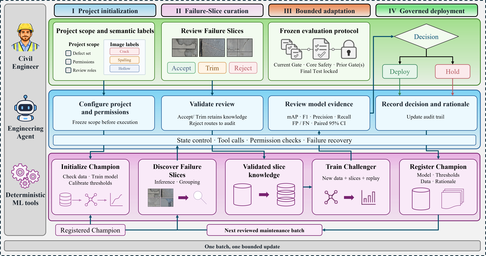
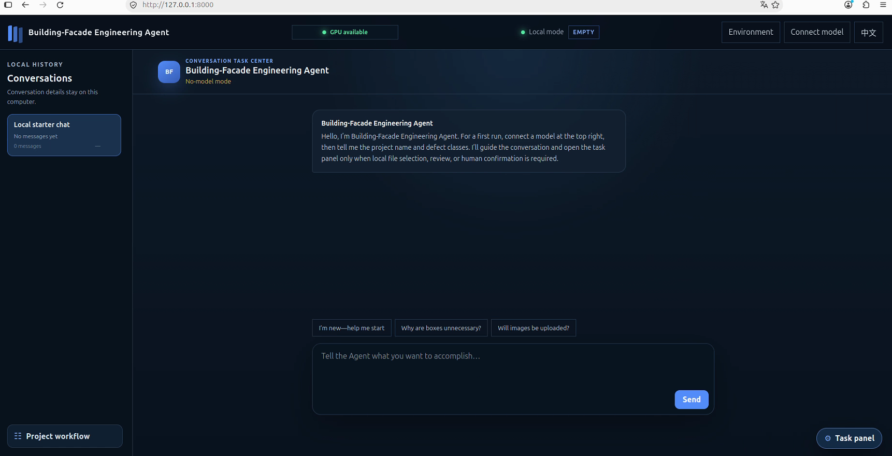
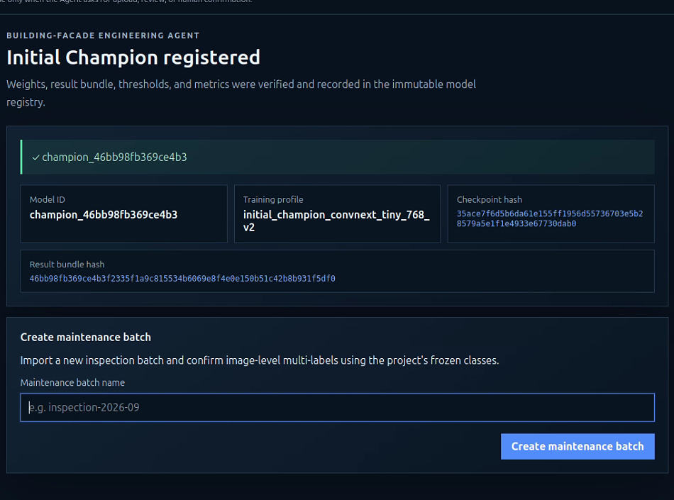
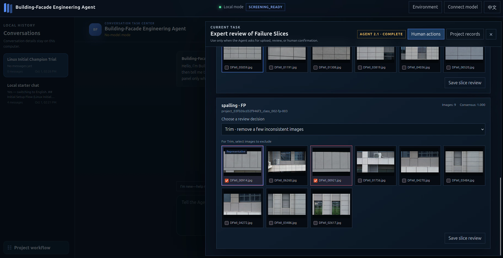

# Building-Facade Engineering Agent

Building-Facade Engineering Agent is a conversation-first, human-governed
system for maintaining image-level multi-label building-facade classifiers. It
connects project setup, data review, Initial Champion training, failure
discovery, expert review, Challenger training, independent evaluation, and the
engineer's final `Retain` or `Promote` decision in one auditable workflow.

This repository contains research software. It is not a substitute for a
professional facade inspection, engineering diagnosis, or safety decision.

Companion dataset: [BFD-ML-4K on Hugging Face](https://huggingface.co/datasets/LotusRosa/BFD-ML-4K).

<p align="center">
  
</p>

<p align="center"><em>Human-governed Engineering Agent framework prepared by the authors.</em></p>

## What the Agent provides

- Image-level multi-label classification without requiring bounding boxes or
  segmentation masks.
- One governed workflow shared by chat and the Task Panel.
- Explicit human confirmation before every state-changing or GPU-intensive
  action.
- Independent Champion-Challenger evaluation on a fresh Current Gate and
  cumulative Core Safety.
- Multi-project isolation with one persistent, global, first-in-first-out GPU
  queue.
- One GPU and one Worker process per job for broad workstation compatibility.
- SQLite audit history with state transitions, timestamps, and SHA-256
  integrity records.

## Workflow at a glance

```text
Create project
  -> define the frozen class taxonomy
  -> import and label initial training data
  -> freeze the initial dataset
  -> train and register the Initial Champion
  -> import a maintenance batch
  -> discover Champion failures
  -> complete expert Failure Slice review
  -> train and register a Challenger candidate
  -> evaluate Champion and Challenger
       on fresh Current Gate + cumulative Core Safety
  -> engineer chooses Retain or Promote
  -> fold the completed Current Gate into cumulative Core Safety
  -> begin the next maintenance round
```

The Agent never promotes a model automatically. `Retain` keeps the current
Champion. `Promote` makes the evaluated Challenger the Active Champion while
preserving prior model versions and their auditable decision history.

## Interface walkthrough

The screenshots below were captured during the v2.1.0 validation workflow.
They illustrate the shared conversation-and-Task-Panel interface; project data
and model artifacts remain local to the engineer's machine.

### Conversation-first project entry

<p align="center">
  
</p>

The conversation surface handles intent and guidance, while the Task Panel
opens for controlled local actions such as file selection, review, and human
confirmation.

### Registered Initial Champion

<p align="center">
  
</p>

Verified model identity, training profile, checkpoint hash, and result bundle
hash are recorded before recurring maintenance begins.

### Expert review of Failure Slices

<p align="center">
  
</p>

Engineers accept, trim, or reject candidate Failure Slices before any
Challenger job is frozen. The Agent records the decision without replacing
expert judgment.

## Requirements

The Agent interface can be installed before the GPU runtime is prepared.

- 64-bit Linux or Windows.
- Python 3.11 or newer; Python 3.12 is recommended.
- A modern web browser.
- For GPU jobs: one visible NVIDIA GPU with compute capability 7.0 or newer and
  at least 5 GiB of reported memory.
- An LLM connection is optional. The deterministic Task Panel remains usable in
  no-model mode.

The repository does not bundle CUDA, PyTorch, pretrained weights, datasets, or
trained project models. GPU dependencies and the verified ConvNeXt-Tiny
initialization are installed or downloaded only after the engineer explicitly
confirms environment preparation.

## Third-party software, pretrained weights, and services

The Agent's Academic Research License covers only the original project
materials. Direct dependencies such as PyTorch and TorchVision retain their own
licenses. The GPU setup scripts install pinned packages into the user's chosen
environment; the repository and standard source release do not include their
wheels, CUDA, or other binary runtimes.

The optional `ConvNeXt_Tiny_Weights.IMAGENET1K_V1` initialization is downloaded
separately to the user's cache. Engineers are responsible for checking the
applicable pretrained-weight and dataset terms before use. Optional LLM endpoint
presets are likewise governed by each provider's terms and privacy policy.

See [`THIRD_PARTY_NOTICES.md`](THIRD_PARTY_NOTICES.md) for the reviewed direct
dependency inventory, official license links, pretrained-asset warning, and
redistribution guidance.

## Install the Agent

### Linux

From the repository directory:

```bash
python3.12 -m venv /path/to/venvs/bfea-agent
source /path/to/venvs/bfea-agent/bin/activate
python -m pip install -e .
python -m facade_agent --check
```

A successful installation prints:

```text
FACADE_AGENT_CHECK_OK
```

### Windows PowerShell

From the repository directory:

```powershell
py -3.12 -m venv C:\venvs\bfea-agent
C:\venvs\bfea-agent\Scripts\Activate.ps1
python -m pip install -e .
python -m facade_agent --check
```

## Prepare the optional GPU runtime

The Agent can detect a missing runtime and request confirmation before running
the platform setup script. It can also be prepared manually.

### Linux

Activate the Agent environment, then run:

```bash
PYTHON_BIN=/path/to/venvs/bfea-agent/bin/python \
CUDA_WHEEL=cu124 \
bash setup_linux_gpu.sh
```

### Windows PowerShell

```powershell
.\setup_windows_gpu.ps1 `
  -Python C:\venvs\bfea-agent\Scripts\python.exe `
  -CudaWheel cu124
```

The setup script installs the locked Worker dependencies, reports the detected
GPU environment, downloads the pretrained initialization to the user's cache,
and runs a one-GPU smoke test. It does not start project training.

To inspect readiness at any time:

```bash
python -m facade_training_worker.diagnostics --json --required-gpus 1
```

Read [`SUPPORTED_ENVIRONMENTS.md`](SUPPORTED_ENVIRONMENTS.md) before preparing a
different CUDA configuration.

## Start the Agent

Activate the same environment and start the local service.

### Linux

```bash
bash run_linux.sh
```

### Windows PowerShell

```powershell
.\run_windows.ps1
```

Open [http://127.0.0.1:8000](http://127.0.0.1:8000) in a browser. The service
binds to the local machine by default.

## Chat and Task Panel responsibilities

Both interfaces use the same governed tools, confirmation rules, project state,
and audit records.

- **Chat** interprets intent, explains the next allowed step, calls governed
  tools, and presents required confirmations.
- **Task Panel** handles local file selection, absolute model paths, image
  labels, expert Failure Slice review, queue status, logs, and progress.

Chat cannot bypass a confirmation or create a second workflow. When a task needs
local files, image inspection, labels, or an absolute path, the Agent directs
the engineer to the relevant Task Panel control.

## First project: create the Initial Champion

1. Create a project and provide its name, frozen defect classes, and an
   engineer-selected absolute model storage directory.
2. Split initial data into Train and a disjoint Core Safety seed. Import only
   Train; keep the seed for the first paired evaluation. Import verified labels
   or annotate inside the Agent using the frozen taxonomy.
3. Resolve any completeness, integrity, duplicate, or class-support errors.
4. Confirm and freeze the initial labels and dataset version.
5. Generate the immutable Initial Champion training job.
6. Confirm GPU execution. The job enters the global GPU queue and uses one GPU
   when it reaches the front.
7. Review the verified result and explicitly register the Initial Champion.

The model storage directory is locked after the first model is registered. Each
registered version receives its own directory containing the checkpoint and a
manifest with model lineage, hashes, classes, thresholds, and training profile.

## Image folders and annotation guide

Use the same input format for initial training, maintenance, and independent
evaluation. Choose a local folder in the Task Panel; a ZIP is not required.
JPEG/PNG images in subfolders are included. Image filenames must be unique
across the selected folder, including subfolders.

```text
inspection_batch/
  image_001.jpg
  image_002.jpg
  image_003.jpg
  image_004.jpg
  labels.xlsx             # optional; UTF-8 labels.csv is also supported
```

The Agent counts the images and looks for `.xlsx` or `.csv` tables. With one
table, it validates that table; with several, it asks you to select one. Without
a table, you can annotate directly inside the Agent. Files are copied into the
local project, not uploaded to an external service.

### One image per row, one defect per column

Download the project's Excel template from the Task Panel. It uses the frozen
class names defined by the engineer, not a fixed list of defects. After images
are imported, the template also contains their exact filenames. Use one
worksheet; do not add summary or QA sheets, merged cells, or formulas.

For a project with `hollow`, `spalling`, and `crack`, the table is:

| filename | hollow | spalling | crack | no_defect |
| --- | ---: | ---: | ---: | ---: |
| image_001.jpg | 1 | 0 | 1 | 0 |
| image_002.jpg | 0 | 1 | 0 | 0 |
| image_003.jpg | 0 | 0 | 0 | 1 |
| image_004.jpg | | | | |

- **0** means the defect is absent; **1** means it is present.
- Several defect columns may be `1`: the first image above has both hollow and
  crack labels. Labels describe the whole image, not boxes or coordinates.
- `no_defect=1` explicitly confirms a negative image. All defect columns must
  then be `0`. It cannot be combined with any positive defect label.
- All label cells blank means **unannotated**, not a negative image. A missing
  image row also remains unannotated. Blank rows never erase existing labels.
- **All zeros are invalid**. To label a negative, set `no_defect=1`. Partially
  blank label rows are invalid too; fill every label cell with 0/1 or leave all
  label cells blank.
- `filename` must match the full image filename including its extension, not
  an ID, a row number, or a subfolder path. Matching ignores capitalization.
  Repeated filenames, unknown images, extra columns, and unknown classes are
  rejected with an error. Other legacy table layouts are not guessed.

If a class is literally named `filename` or `no_defect`, the downloaded template
prefixes every defect header with `class:` to avoid ambiguity. Keep the headers
from that template. Negative images are not a separate trainable defect class.

### Expected behavior after import

The Agent previews the number of labels to apply, existing labels that would
be updated, and images still unannotated. It applies labels only after your
confirmation. Invalid tables apply **no labels**; the imported pictures stay
available for correction or built-in annotation. If labels or images changed
since preview, preview again before confirming.

Complete valid training/maintenance labels skip manual annotation and trigger
the existing dataset checks. Only a passing dataset is frozen. Missing or
invalid labels cannot start training; integrity, duplicates, and class-support
checks still apply. Table import never starts a GPU job or switches a model.

For manual annotation, select one or more defects, or **No defect** alone.
Keyboard shortcuts follow project order: A for the first class, B for the
second, and so on; No defect receives the next available letter. Shortcuts are
shown beside the labels (up to Z). Press Enter to save and advance, or choose
**Next unannotated image**. Use **Export Excel labels** to save the same
one-image-per-row format with the annotations completed inside the Agent.

You can ask chat `annotation status` or `标注情况` to read the current image,
annotated, and unannotated counts. Chat can guide you to table import or manual
annotation without guessing labels or bypassing confirmation.

The selected interface language controls page captions, file-selection buttons,
and new governed chat replies. User-defined class names, filenames, identifiers,
stored conversations, and original diagnostic logs are preserved. The operating
system controls the language of the native file-selection window.

## Recurring maintenance round

### 1. Import and freeze new maintenance data

Before initial training, partition the initial images into **Train** and a
disjoint **Core Safety** seed. Import only Train for initial training; keep
the reserved seed for the first paired evaluation. Core Safety is reserved once.

When a Champion is already registered, continue its maintenance round rather
than retraining an Initial Champion. Every round needs separate **Train**
(maintenance/update) and **Current Gate** folders:

```text
round_02/
  maintenance/             # screening, expert review, and update training
    images...
    labels.xlsx            # optional
  current_gate/            # this round's independent evaluation
    images...
    labels.xlsx            # optional
```

Select each folder separately for its declared role; do not select `round_02`
as one mixed image set. For the first paired evaluation only, also import the
reserved initial Core Safety folder. Later rounds do not request a new safety
folder. The Task Panel's round-preparation controls let you
import and annotate evaluation folders early, then return to maintenance data.
Early evaluation labels are retained, but the evaluation job cannot be frozen
until a Challenger has been registered. There is no enforced fixed percentage:
suggested Train:holdout ratios are **7:3** or **8:2** (initial holdout = Core
Safety seed; maintenance-round holdout = Current Gate). These are guidance, not
automatic partitioning. The engineer chooses the allocation, with class coverage and adequate sample
counts checked or reviewed for each purpose. Evaluation cohorts need positive
examples for every frozen class. Keep related acquisitions together when
partitioning; exact-content checks cannot detect every near-duplicate image.

Create a maintenance batch, import the new images, apply the frozen project
taxonomy, resolve validation errors, and confirm the frozen label version.

### 2. Run Champion failure discovery

The Agent screens the frozen batch with the Active Champion and its frozen
class thresholds. It performs one controlled discovery pass and creates
candidate Failure Slices. This step does not train, tune thresholds, or deploy a
model.

### 3. Complete expert review

Review every Failure Slice in the Task Panel:

- `Accept` keeps the verified slice.
- `Trim` removes selected inconsistent members.
- `Reject` excludes the slice from Challenger preparation.

After every slice has a decision, confirm and freeze the review version.

### 4. Train and register a Challenger

Generate the immutable Challenger job under the fixed update protocol, confirm
execution, and wait for the single-GPU Worker. After the Agent verifies the
result bundle, explicitly register the trained weights as a Challenger
candidate. Registration does not change the Active Champion.

### 5. Supply independent evaluation folders

In the Task Panel, select **Current Gate** and import its fresh image folder.
For the first evaluation only, also select **Initial Core Safety** and import
the reserved seed folder. Each required folder may include an Excel/CSV table;
you can also complete missing labels inside the Agent. Select each role's
folder separately. Each required new evaluation cohort must be nonempty, fully
annotated, and have positive support for every project class.

The backend automatically attaches existing cumulative Core Safety. Subsequent
rounds supply only a fresh Current Gate for evaluation; each still requires its
own separate Train/maintenance data. Users do not need to recreate old history or
manually build evaluation ZIPs. Legacy package input remains available in a
collapsed compatibility section.

Evaluation images must not overlap Discovery or training data. Gate images are
never added to replay training.

### 6. Run paired evaluation

Confirm the immutable evaluation job. The Worker evaluates both the Champion
and Challenger on:

- **Current Gate**: the fresh independent cohort for this round.
- **Core Safety**: the reserved initial safety seed plus all completed prior
  Current Gates. No new, separate safety addition is required each round.

The Agent recomputes aggregate, per-class, and paired per-image evidence from
the returned probabilities. Evaluation never changes thresholds or selects a
model automatically.

### 7. Make the terminal round decision

Review the evidence, enter a reason, and choose exactly one decision:

- `Retain Champion`: keep the current Active Champion.
- `Promote Challenger`: make the evaluated Challenger the Active Champion.

Either decision completes the round. The completed Current Gate becomes part
of cumulative Core Safety (the initial seed is activated at the first decision),
and eligible Discovery data can become history replay
for later Challenger training. Start another maintenance batch to continue the
cycle.

## Data separation across rounds

```text
Training side:
  initial Train + this round's reviewed update data
                + eligible Discovery data from earlier completed rounds

Evaluation side:
  round 1: fresh Gate G1 + reserved safety seed S0
  round r: fresh Gate Gr + safety history S(r-1)
  after completed evaluation and human decision: Sr = S(r-1) + Gr
```

Evaluation cohorts never enter training. Core Safety grows as rounds complete,
so later updates must preserve evidence from a broader history rather than only
the original project distribution.

## Multiple projects and the global GPU queue

One Agent instance can maintain multiple isolated projects. File preparation,
annotation, expert review, and result inspection can proceed independently.

Initial Champion training, failure discovery, Challenger training, and paired
evaluation share one persistent FIFO queue. Only one single-GPU Worker runs at a
time across the entire Agent. Other jobs show the project, task type, and queue
position. A queued job may be cancelled before it starts.

## Local files and privacy boundaries

Runtime project material is intentionally excluded from this repository:

```text
data/            local database
projects/        per-project workspaces
inbox/           packages awaiting local import
artifact_store/  verified immutable artifacts
models/          legacy model layout only
audit/           audit exports
exports/         generated job and report bundles
```

New projects use the absolute model directory selected by the engineer. The LLM
does not receive image bytes, choose model paths, execute GPU calculations, or
decide whether to promote a model. API keys are not persisted by the Agent.

## Common status messages

- `EMPTY`: no project exists yet; create one from Project Workflow.
- `No-model mode`: no LLM is connected; deterministic Task Panel operations are
  still available.
- `GPU unavailable`: run diagnostics and prepare the GPU runtime after checking
  the driver and supported environment.
- `Queued`: another project owns the single global GPU Worker; the job will
  start when it reaches queue position one.
- A confirmation dialog is expected before every irreversible, state-changing,
  or GPU-starting action.

## Verify a source checkout

Install the test runner, then execute the suite:

```bash
python -m pip install pytest==7.4.4
OMP_NUM_THREADS=1 MKL_NUM_THREADS=1 python -m pytest tests -q
```

## Technical references

- [`ACCUMULATING_GATE_PROTOCOL.md`](ACCUMULATING_GATE_PROTOCOL.md): Current Gate
  and cumulative Core Safety contract.
- [`SUPPORTED_ENVIRONMENTS.md`](SUPPORTED_ENVIRONMENTS.md): supported runtime and
  GPU boundaries.
- [`AGENT_COMPLETE_GPU_HANDOFF.md`](AGENT_COMPLETE_GPU_HANDOFF.md): Worker
  integration and operational handoff.
- [`THIRD_PARTY_NOTICES.md`](THIRD_PARTY_NOTICES.md): direct dependency,
  pretrained-weight, and external-service notices.

## Citation

Citation is mandatory for every public research output that uses this Software.
Use the following software citation:

```text
Xia, Yu, and Chen, Ruoyu. (2026).
Building-Facade Engineering Agent (Version 2.2.0) [Computer software].
https://github.com/LotusRosa/building-facade-engineering-agent
```

Machine-readable citation metadata is provided in [`CITATION.cff`](CITATION.cff).

## Authors

- **Yu Xia** — first author and repository maintainer
- **Ruoyu Chen** — corresponding author
  (`chenruoyu@just.edu.cn`)

Copyright in the first-party Agent release is held by Yu Xia and Ruoyu Chen.

## License

Building-Facade Engineering Agent is released under the
**Building-Facade Engineering Agent Academic Research License 1.0**. It may be
used only for non-commercial academic or scientific research. Commercial use,
redistribution, re-hosting, sublicensing, and offering the Software as a service
require prior written permission from the copyright holders. Citation and clear
attribution are mandatory.

This is a custom research-only source-available license, not an open-source
license. See [`LICENSE`](LICENSE) for the complete terms.

Third-party components and services are not relicensed by the project license.
Their independent terms are summarized in
[`THIRD_PARTY_NOTICES.md`](THIRD_PARTY_NOTICES.md).
